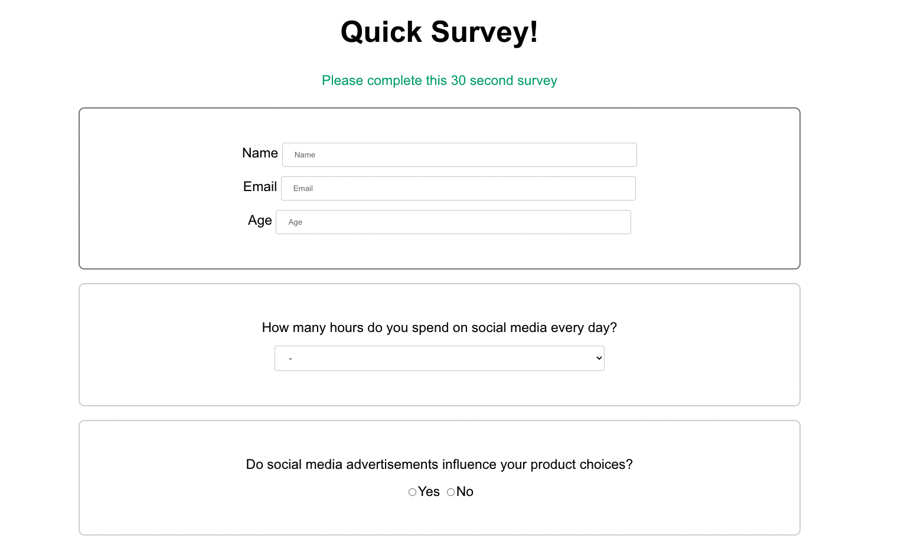
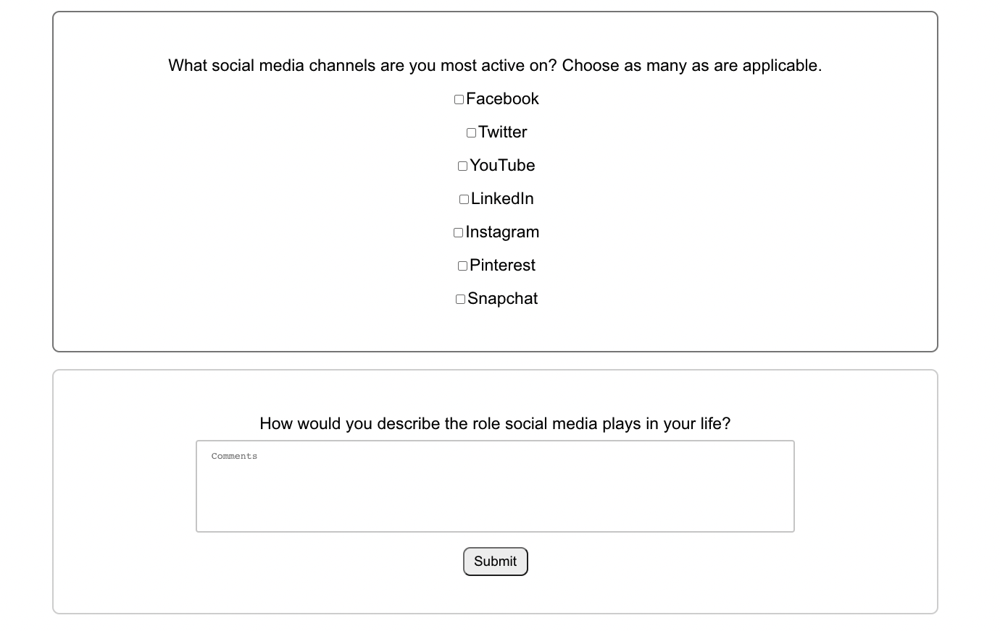
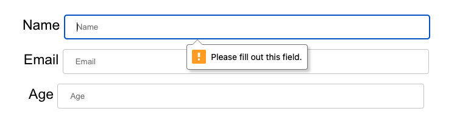
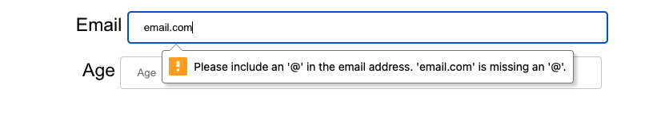
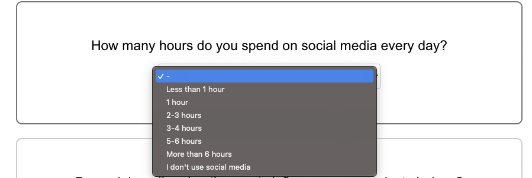
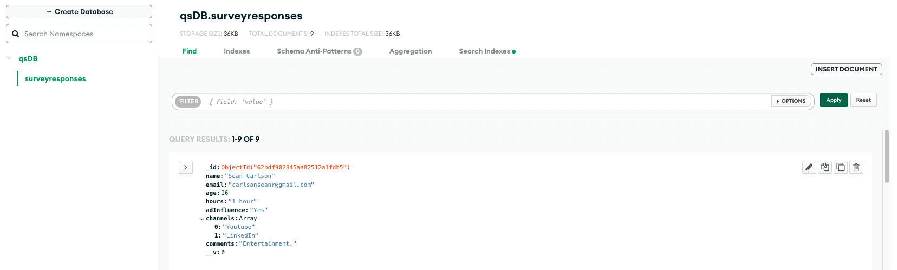

  <h1 align="center">Quick Survey</h1>

  

    A short survey that collects user responses in a MongoDB database.
     
    <a href="https://quicksurvey3000.herokuapp.com/" target="_blank"><strong>Live Site »</strong></a> 
    <a href="https://youtu.be/n1jdsOotTz8" target="_blank"><strong>Demo Video »</strong></a>
     
     
  

  
Table of Contents

  <ol>
    <li>
      <a href="#about-the-project">About The Project</a>
      <ul>
        <li><a href="#built-with">Built With</a></li>
      </ul>
    </li>
    <li><a href="#screenshots">Screenshots</a></li>
    <li><a href="#contact">Contact</a></li>
  </ol>

## About The Project

Site Features:
* A quick social media survey with seven prompts for user input
* Once submitted, survey responses are collected in a MongoDB database
* Error messages for when an input is left empty
* Error message when email is entered with improper format
* This survey site is fully responsive for all devices

### Built With

* MongoDB
* Mongoose
* Javascript
* Express.js
* Node.js
* HTML
* CSS

## Screenshots

  
  
  
  
  
  

<!-- CONTACT -->
## Contact

Sean Carlson - carlsonseanr@gmail.com - <a href="https://www.linkedin.com/in/sean-carlson-5954b5161" target="_blank">LinkedIn</a>

(<a href="#top">back to top</a>)

